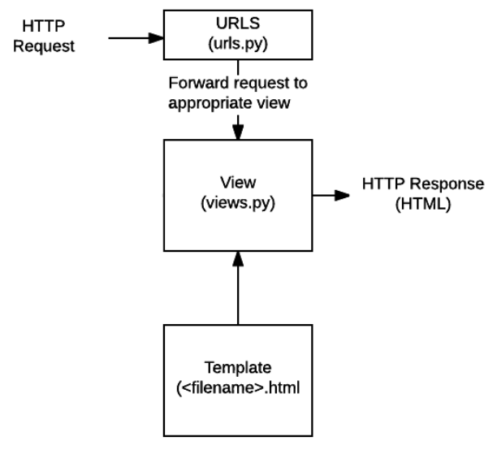

==Django (python):== (already installed with Kali)

- To create a new project, run this command.

`django-admin startproject {project_name}`

- This creates a directory dedicated to your project, which contains:
    - a directory named after your project
    - a python script called manage.py, that lets you interact with your Django project in various ways, by running the command
        `python3 manage.py {command}`
        The most common commands are
        - **migrate**, to automatically configure new files (reccomended to run after creating a new project) or migrate changes
        - **runserver**, to deploy the website on your server. Append 0.0.0.0:8000 to the command to run the server only to your local network.
        - **createsuperuser**, to create an admin account for your Django web admin panel (endpoint: /admin)
        - \*\*startapp, \*\*to initialize an app for your project. Projects can have infinite amount of apps. The syntax is
            `python3 manage.py startapp {app_name}`
- How to create a website
    - step 1: create an app using the command I explained above
    - step 2: Head over to settings.py and include your app name in \*INSTALLED_APPS\*
    - step 3: Head over to urls.py and add this line in the array 'urlpatterns'
        `path('{app_name}/', include('{app_name}.urls'))`
        <ins>NB: You have also to import 'include' from django.urls</ins>, otherwise you'll get an error!
    - step 4: create a urls.py file in the app directory. Here's a template for that:

```Python
# urls.py
from django.urls import path

from . import views

app_name = '{app_name}'
urlpatterns = [
        path('', views.index, name='index')
]
```

'index' is the name of a function we need to define in views.py (see the image below for more info).
NB: let's say the first argument of path is "/example". To access that, the endpoint becomes /{app_name}/example

- - step 5: write the function in the views.py. Here's a basic one:

```Python
from django.http import HttpResponse

def index(request):
    return HttpResponse("Hello World!")
```

- - step 6: migrate changes
        \- step 7: start the server, head over to the endpoint `/{app_name}` and you should see your app
- How does django handle http requests?



- **Templates:**
    - with templates Django is able to automatically generate HTML markdown
    - templates need to be stored in a 'templates' in your app's folder
    - to understand how templates work let's look at this base.html file:

```HTML
<!DOCTYPE html>
<html lang='en'>
<head>
        <meta charset="UTF-8">
        <title>My website </title>
</head>
<body>

         

</body>
</html>
```

- - let's create now an html file that inherits from base.html

```HTML




Hello, World!


```

- - to show this page to the client we need to modify our views.py, and we have to invoke the function `render(request, 'index.html')`