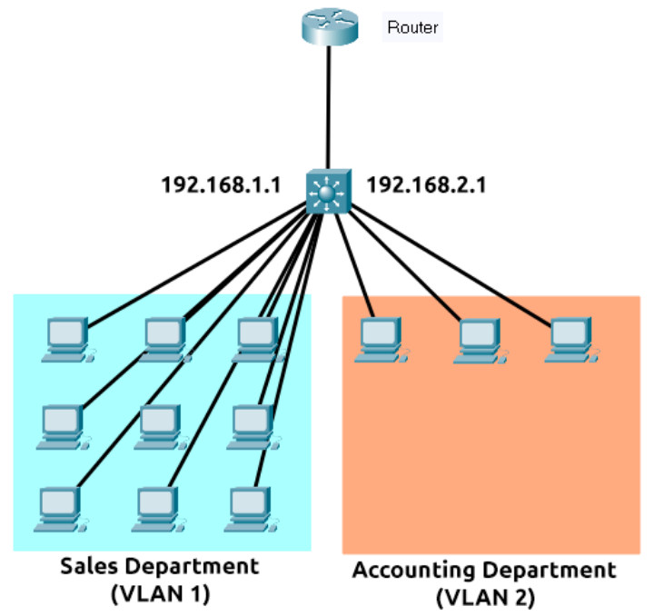

- lowest address in a subnet (ex. 192.168.1.0) is called **network address**, and it's used to identify a network existence
- highest address in a subnet (ex. 192.168.1.255) is called **default gateway**, and is assigned to a device that is capable of sending information to another network
- **ARP Protocol:**
    - allow devices to identify themselves over a network (associate MAC address with an IP address over a network)
    - each device has a cache that stores the identifiers of other devices over the network
    - ARP request: sent by a device to all the other devices over a network asking whether the device's MAC address matches the requested IP address
    - ARP reply: is sent back to the initial device, that stores the MAC address in its cache
- **Things about DNS:**
    - TLD (top-level domain) is the most righthand part of a domain name (example: .com).
        - gTLD (generic TLD): tell the purpose of the domain's name (.com for commercial, .org for organization, .edu for education)
        - ccTLD (country code TLD): for geographical purposes (.it for italy, .ca for canada, .co.uk for united kingdom and so on)
    - Second-Level Domain: limited to 63 characters and can only use a-z, 0-9 and hypens (cannot start with or end with or have consecutive hypens)
    - Subdomain: left-hand side of the Second-Level Domain
        - same restrictions as Second-Level Domain
        - you can have multiple subdomains, but the length of the domain must be kept to 253 characters or less.
    - Types of DNS records:
        - <ins>A record</ins>: resolve to IPv4 addresses
        - <ins>AAAA record:</ins> resolve to IPv6 addresses
        - <ins>CNAME record</ins>: resolve to another domain name (so another DNS request will be made)
        - <ins>MX record</ins>: resolve to the address of the servers that handle the email for the domain you are querying. There's also a priority flag system that tells the client in which order to try the servers
        - <ins>TXT record</ins>: free text field where any text-based data can be stored. It has multiple uses, some common ones are:
            - list servers that have the authority to send an email on behalf of the domain (can help against spamming and spoofing)
            - verifying ownership of the domain name when signing up for third party services.
    - What happens after making a DNS request:
        - the local cache is checked first. If nothing is found a request to your recursive DNS server (provided by your ISP but also choosable by you) will be made
        - The recursive DNS server checks its local cache, and if a result is found locally (common for popular services such as Google) the request ends here.
        - If no result is found a request to the root DNS servers is made. Their job is to redirect you to the correct Top Level Domain server, depending of course on the TLD of the URL of your request
        - The TLD server holds records for where to find the **authoritative DNS server(s) (also called nameserver for the domain)** to answer the request.
        - The DNS record, once found, is sent back to the recursive DNS server and cached. The DNS record has a TTL value that says how much time before it has to be looked up again.
        - (https://assets.tryhackme.com/additional/dnsindetail/dns.png)
    - You can make DNS requests from the terminal using
        - the command `nslookup --type=TXT website.com`
        - the comand `dig <domain> @<dns-server-ip>`, to query a specific DNS server
        - and there's also a more general command `whois website.com`
- **Virtual Hosts**:
    - web servers can host multiple websites with different domains
    - the web server check the Host HTTP Header when it receives a request, and it tries to match that with a list with all its virtual hosts. If no match is found, the default website will be provided.
    
- **Firewalls:**
    - device within a network responsible for determing what traffic is allowed to enter or exit
    - stateful firewall: rather than inspecting an individual packet, this firewall determines the behaviour of a device based upon the entire connection
        - consumes more resources
        - it blocks the entire device if a connection is bad
    - stateless firewall: uses a static set of rules and analyzes the individual packets.
        - fewer resources
        - doesn't always block the entire device
        - generally more stupid (their effectiveness depends only by their rules)
        - they're great when receiving large amounts of traffic (like during a DDoS attack)
- **VPN (Virtual Private Network):**
    - technology that allows devices on separate networks to communicate securely over the internet by creating a dedicated path (also known as tunnel). Devices connected withing this tunnel form their own private network.
    - benefits:
        - allows networks in different geographical locations to be connected (securely!)
        - offers privacy as the data is encrypted (useful with public Wifi
        - offers anonymity, as long as the vpn doesn't log your history/data
    - VPN technologies
        - PPP: private key & certificate must match to connect (like SSH). Cannot leave a network!
        - PPTP: like PPP but it can actually leave a network. weakly encrypted in comparison to other methods.
        - IPSec: encrypts data using the IP protocol. stronger encryption than PPTP
- **Switches**
    - they usually operate at layer 2 of the OSI model
    - layer 3 switches also exist, and they operate through VLANs

- **Load balancers**:
    - some websites have more than one server, because they receive a lot of traffic. A load balancer decides on which server to forward a client's request
    - they also provide a failover if a server becomes unresponsive
    - they perform a health check regularly, to ensure they are running correctly
- **CDN (Content Delivery Networks)**:
    - allows you to host static files from your website across thousands of servers all around the world
    - perfect for cutting down the traffic to a busy wait
    - a common use is for software updates!
- **WAF (Web Application Firewall)**:
    - protect the server from hacking or DoS attacks
    - analyses web requests for common attack techniques and limites the rate of requests from an IP.